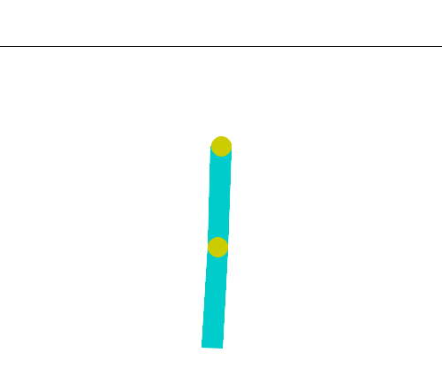

# Neuro-evolution-of-augmented-topologies

This project applies the NEAT (NeuroEvolution of Augmenting Topologies) algorithm to evolve neural network structures in three Gymnasium environments: CartPole, Pendulum, and Acrobot. It explores how architectures and activation functions adapt to different control tasks and compares graph-based networks with traditional FeedForward models, considering ways to simplify evolved networks into matrix-based forms.

# CartPole

The CartPole environment is a classic control problem where a pole is attached to a moving cart.  The goal is to balance the pole upright by applying forces to the cart in left or right directions.  This environment is commonly used to test reinforcement learning algorithms and control strategies.

### How it Works

- The cart moves along a frictionless track, and the pole pivots around a joint.  
- The agent can apply a fixed force either to the left (0) or right (1).  
- The episode ends if the pole angle exceeds ±12° or the cart position exceeds ±2.4 units.

###### Environment Parameters

- **Action Space:** two discrete actions → 0: left, 1: right  
- **Observation Space:** 4-dimensional → [Cart Position, Cart Velocity, Pole Angle, Pole Angular Velocity]  
- **Reward:** +1 for each step the pole remains balanced  
- **Starting State:** Observations initialized randomly in (-0.05, 0.05)

### Rewards

The agent receives **+1 reward** for every step the pole remains upright, including the termination step. Default reward thresholds are **500 for v1** and **200 for v0**. If `sutton_barto_reward=True`, each non-terminating step gives **0 reward**, while each terminating step gives **-1**, resulting in a threshold of **0**.

 

# Pendulum

The Pendulum environment is a classic control problem where a single pendulum is attached to a fixed point. The goal is to apply continuous torque to swing the pendulum upward and keep it balanced in the upright position.

### How it Works

- The system consists of a single rigid pendulum with one fixed pivot point.
- The pendulum starts in a random position with some angular velocity.
- The agent applies a continuous torque to the pendulum.
- The objective is to swing the pendulum upright and minimize angular velocity and control effort.

###### Environment Parameters

- **Action Space:** continuous → torque ∈ [-2.0, 2.0]
- **Observation Space:** 3-dimensional →  
  [cos(θ), sin(θ), θ̇]
- **Reward:** negative cost based on angle, angular velocity, and applied torque
- **Starting State:** random angle in [-π, π] and angular velocity in [-1, 1]

### Rewards

The reward function is defined as: r = -(θ² + 0.1 · θ̇² + 0.001 · torque²)

- Maximum reward: **0** (pendulum upright, no velocity, no torque)
- Minimum reward: approximately **-16.27**

The reward encourages the pendulum to stay upright while minimizing motion and energy usage.

**Termination Condition**
Truncation: Episode length exceeds **200 steps**
The environment does not have a terminal success state; episodes always run until truncation.

 

# Acrobot

The Acrobot environment is a classic control problem consisting of a two-link pendulum system with one fixed end. Only the joint between the two links is actuated. The goal is to swing the free end of the system above a target height by applying torques to the actuated joint.

### How it Works

- The system consists of two rigid links connected in a chain.
- The base of the first link is fixed, while the second joint is actuated.
- The agent applies discrete torques to swing the free end upward using momentum.
- The episode ends when the free end reaches the target height or the step limit is exceeded.

###### Environment Parameters

- **Action Space:** 3 discrete actions  
  - 0: apply -1 torque  
  - 1: apply 0 torque  
  - 2: apply +1 torque
- **Observation Space:** 6-dimensional →  [cos(θ₁), sin(θ₁), cos(θ₂), sin(θ₂), θ̇₁, θ̇₂]
- **Reward:** -1 for each step until the goal is reached, 0 on success
- **Starting State:** Joint angles and angular velocities initialized uniformly in (-0.1, 0.1)

### Rewards

The agent receives **-1 reward** at every step until the free end of the second link reaches the target height.  
When the goal is achieved, the episode terminates with a reward of 0.  
The default reward threshold is **-100**.

**Termination Conditions**

- Success:  -cos(θ₁) - cos(θ₁ + θ₂) > 1.0
- Truncation:  Episode length exceeds **500 steps** (200 in v0)

# Joint Analysis

In addition to implementing CartPole, Acrobot, and Pendulum, we introduced several experimental extensions to analyze learning behavior and model design choices:

1. **Activation Functions**  
   We compared different activation functions to evaluate their impact on training stability, convergence speed, and final performance, especially under sparse or delayed rewards.

2. **Hyperparameter Sensitivity**  
   Key parameters (e.g. learning rate, mutation strength, population size) were varied to study trade-offs between learning speed and solution accuracy across environments of increasing difficulty.

3. **Network Architecture**  
   We analyzed differences between feedforward networks and graph-based (topology-evolving) models, showing how flexible graph structures can better capture complex dynamics at the cost of higher structural complexity.

Overall, these experiments highlight how **architecture**, **activation choice**, and **parameter** tuning jointly influence learning efficiency and robustness in classic control tasks.