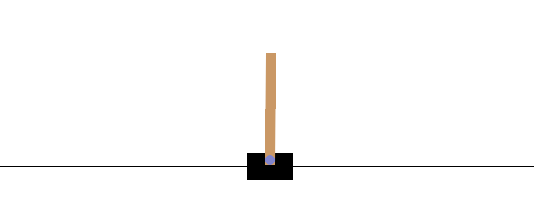

# CartPole with NEAT (Gymnasium)

CartPole is a classic reinforcement learning control problem where an agent must balance an inverted pendulum mounted on a moving cart. The cart can move left or right along a frictionless track, while the pole is attached via a passive joint and naturally tends to fall due to gravity.

## CartPole Environment

### Action Space

- **Discrete(2)**
  - `0` – push the cart to the left  
  - `1` – push the cart to the right  

The applied force is fixed in magnitude, but its effect depends on the current pole angle and system dynamics.

### Observation Space

A 4-dimensional continuous state vector:

1. **Cart position** (x)
2. **Cart velocity**
3. **Pole angle** (radians)
4. **Pole angular velocity**

Although observations can take wide numerical ranges, an episode terminates earlier if safety limits are exceeded.

### Rewards

- Default: **+1 reward for every timestep**, including the terminal step  
- Goal: maximize the total episode length (up to 500 steps in `v1`)

### Episode Termination

An episode ends if:

- The pole angle exceeds ±12°
- The cart position exceeds ±2.4 units
- The maximum episode length (500 steps) is reached

### Initial State

- All state variables are initialized randomly in a small range around zero

---

## NEAT Approach

Instead of learning via value functions or policy gradients, this project applies **NeuroEvolution of Augmenting Topologies (NEAT)**:

- Neural networks are evolved through mutation and crossover
- Both **weights** and **network structure** change over generations
- Fitness is defined as the total reward achieved in one CartPole episode

The best-performing genome is saved and reused for visualization and evaluation.

---

## Project Files

- **training script**  
  Evolves a population of neural networks using NEAT and evaluates them in the CartPole environment. Saves the best genome to disk.

- **winner playback (human render)**  
  Loads the trained genome and runs it in real time using Gymnasium’s `human` render mode.

- **GIF recorder**  
  Replays the trained agent with `rgb_array` rendering and exports the episode as an animated GIF.

- **network visualization**  
  Generates a Graphviz diagram showing the evolved neural network structure and connection weights.

<!-- PLACE GIF BELOW -->

<!--  -->

The animation shows the evolved agent successfully balancing the pole by applying left and right forces to the cart.

---
